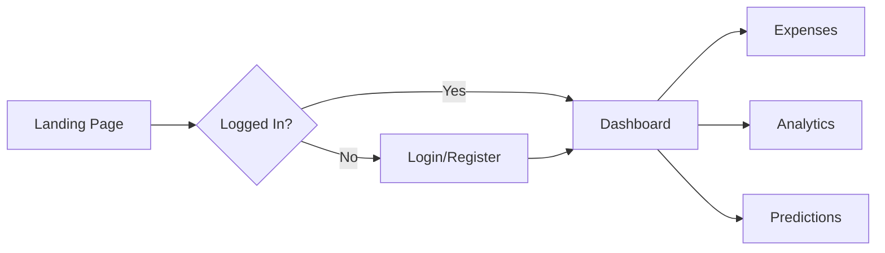

<div align="center">

<br/>


<br/>
<br/>

# 💰 Finance Tracker

### *Intelligent Personal Finance Management with ML-Powered Insights*

[](https://python.org)
[](https://flask.palletsprojects.com)
[](https://sqlite.org)
[](https://scikit-learn.org)
[](LICENSE)

<br/>

**A full-stack personal finance application featuring real-time expense tracking, multi-currency support, advanced Pandas-powered analytics, and machine learning predictions using scikit-learn.**

<br/>

[🚀 Quick Start](#-quick-start) •
[✨ Features](#-features) •
[📖 Documentation](#-documentation) •
[🔌 API Reference](#-api-reference) •
[🤝 Contributing](#-contributing)

<br/>

---

</div>

<details>
<summary><b>📋 Table of Contents</b></summary>

- [Overview](#-overview)
- [Features](#-features)
- [Tech Stack](#️-tech-stack)
- [Quick Start](#-quick-start)
- [Installation](#-installation)
- [Configuration](#️-configuration)
- [Usage Guide](#-usage-guide)
- [Project Architecture](#-project-architecture)
- [API Reference](#-api-reference)
- [Module Documentation](#-module-documentation)
- [Database Schema](#-database-schema)
- [Security](#-security)
- [Troubleshooting](#-troubleshooting)
- [Roadmap](#-roadmap)
- [Contributing](#-contributing)
- [License](#-license)
- [Acknowledgments](#-acknowledgments)

</details>

<br/>

## 📝 Overview

**Finance Tracker** is a comprehensive personal finance management solution designed to help users gain complete control over their spending habits. Built with Python and Flask, this application combines traditional expense tracking with modern data science techniques to deliver actionable financial insights.

### Why Finance Tracker?

| Challenge | Solution |
|-----------|----------|
| 📊 *"Where does my money go?"* | Category-based analytics with visual breakdowns |
| 🌍 *"I spend in multiple currencies"* | Real-time currency conversion with 10+ currencies |
| 🔮 *"What will I spend next month?"* | ML-powered predictions using Linear Regression |
| 📈 *"How are my spending habits changing?"* | Trend analysis with interactive Matplotlib charts |

<br/>

## ✨ Features

<table>
<tr>
<td width="50%">

### 📊 Expense Management
- ✅ Full CRUD operations (Create, Read, Update, Delete)
- ✅ 14 predefined expense categories
- ✅ Date-based filtering and search
- ✅ Bulk expense overview with pagination

</td>
<td width="50%">

### 💱 Multi-Currency Support
- ✅ Real-time rates via ExchangeRate-API
- ✅ 10+ supported currencies (USD, EUR, GBP, etc.)
- ✅ Automatic base currency conversion (INR)
- ✅ Fallback rates for offline capability

</td>
</tr>
<tr>
<td width="50%">

### 📈 Analytics & Insights
- ✅ Monthly spending summaries
- ✅ Category distribution analysis
- ✅ Daily spending trend tracking
- ✅ Comprehensive statistics dashboard

</td>
<td width="50%">

### 🔮 ML-Powered Predictions
- ✅ Linear Regression forecasting
- ✅ R² confidence indicators
- ✅ Spending pattern detection
- ✅ Historical vs. predicted comparisons

</td>
</tr>
<tr>
<td width="50%">

### 📉 Data Visualizations
- ✅ Line charts for trends
- ✅ Bar charts for comparisons
- ✅ Pie charts for distributions
- ✅ Prediction comparison charts

</td>
<td width="50%">

### 🔐 Security
- ✅ SHA-256 password hashing with salts
- ✅ Session-based authentication
- ✅ Protected route decorators
- ✅ SQL injection prevention

</td>
</tr>
</table>

<br/>

## 🛠️ Tech Stack

<div align="center">

| Layer | Technologies |
|:-----:|:-------------|
| **Backend** |   |
| **Database** |  |
| **Data Science** |    |
| **Visualization** |  |
| **Frontend** |     |
| **APIs** |  ExchangeRate-API |

</div>

<br/>

## 🚀 Quick Start

Get up and running in under 2 minutes:

```bash
# Clone the repository
git clone https://github.com/EobardThawne2/finance-tracker.git
cd finance-tracker

# Create and activate virtual environment
python -m venv ftracker
ftracker\Scripts\activate      # Windows
# source ftracker/bin/activate  # macOS/Linux

# Install dependencies
pip install -r requirements.txt

# Run the application
python app.py
```

🎉 **Open your browser and navigate to `http://localhost:5000`**

<br/>

## 📦 Installation

### Prerequisites

| Requirement | Version | Notes |
|-------------|---------|-------|
| Python | 3.10+ | [Download Python](https://python.org/downloads) |
| pip | Latest | Comes with Python |
| SQLite | 3.x | Bundled with Python |

### Step-by-Step Installation

<details>
<summary><b>1️⃣ Clone the Repository</b></summary>

```bash
git clone https://github.com/EobardThawne2/finance-tracker.git
cd finance-tracker
```

</details>

<details>
<summary><b>2️⃣ Set Up Virtual Environment</b></summary>

**Windows (PowerShell):**
```powershell
python -m venv ftracker
.\ftracker\Scripts\Activate.ps1
```

**Windows (CMD):**
```cmd
python -m venv ftracker
ftracker\Scripts\activate.bat
```

**macOS/Linux:**
```bash
python3 -m venv ftracker
source ftracker/bin/activate
```

</details>

<details>
<summary><b>3️⃣ Install Dependencies</b></summary>

```bash
pip install -r requirements.txt
```

**Dependencies installed:**
- `Flask` - Web framework
- `pandas` - Data manipulation
- `scikit-learn` - Machine learning
- `matplotlib` - Visualization
- `requests` - HTTP client
- `python-dotenv` - Environment management

</details>

<details>
<summary><b>4️⃣ Configure Environment Variables</b></summary>

Create a `.env` file in the project root:

```env
# Flask Configuration
SECRET_KEY=your-super-secret-key-change-this-in-production

# Database Configuration
DATABASE_PATH=finance_tracker.db

# External API Keys
EXCHANGE_API_KEY=your-exchangerate-api-key
```

> 💡 **Tip:** Get your free API key from [ExchangeRate-API](https://www.exchangerate-api.com/)

</details>

<details>
<summary><b>5️⃣ Initialize Database</b></summary>

The database is automatically created on first run. For manual initialization:

```bash
python -c "from database.connection import init_database; init_database()"
```

</details>

<details>
<summary><b>6️⃣ Launch Application</b></summary>

```bash
python app.py
```

**Expected output:**
```
Initializing database...
Starting Finance Tracker...
 * Running on http://0.0.0.0:5000
```

</details>

<br/>

## ⚙️ Configuration

### Environment Variables

| Variable | Required | Default | Description |
|----------|:--------:|---------|-------------|
| `SECRET_KEY` | ✅ | `your-secret-key-change-in-production` | Flask session encryption key |
| `DATABASE_PATH` | ❌ | `finance_tracker.db` | SQLite database file path |
| `EXCHANGE_API_KEY` | ❌ | `your-api-key-here` | ExchangeRate-API key for live rates |

### Application Configuration (`config.py`)

```python
class Config:
    SECRET_KEY = os.environ.get('SECRET_KEY')
    DATABASE_PATH = os.environ.get('DATABASE_PATH') or 'finance_tracker.db'
    EXCHANGE_API_KEY = os.environ.get('EXCHANGE_API_KEY')
    EXCHANGE_API_URL = 'https://v6.exchangerate-api.com/v6/'
    DEFAULT_CURRENCY = 'INR'
    RATE_CACHE_DURATION = 43200  # 12 hours in seconds
```

### Supported Currencies

<div align="center">

| Code | Currency | Code | Currency |
|:----:|:---------|:----:|:---------|
| 🇺🇸 USD | US Dollar | 🇦🇺 AUD | Australian Dollar |
| 🇮🇳 INR | Indian Rupee | 🇨🇦 CAD | Canadian Dollar |
| 🇪🇺 EUR | Euro | 🇨🇳 CNY | Chinese Yuan |
| 🇬🇧 GBP | British Pound | 🇸🇬 SGD | Singapore Dollar |
| 🇯🇵 JPY | Japanese Yen | 🇦🇪 AED | UAE Dirham |

</div>

<br/>

## 📖 Usage Guide

### 🔐 Authentication Flow



1. **Register** - Create account at `/register`
2. **Login** - Authenticate at `/login`
3. **Sessions** - Auto-persist for 7 days

### 💸 Managing Expenses

| Action | How To |
|--------|--------|
| **Add** | Dashboard → "Add Expense" → Fill form → Submit |
| **View** | Navigate to `/expenses` for full list |
| **Filter** | Use date range and category filters |
| **Edit** | Click expense → Edit form → Save |
| **Delete** | Click expense → Delete button → Confirm |

### 📊 Viewing Analytics

Access comprehensive insights at `/analytics`:
- **Monthly Summary** - Current month's total and breakdown
- **Category Distribution** - Where your money goes
- **Daily Trends** - 30-day spending pattern
- **Statistics** - Averages, totals, comparisons

### 🔮 Getting Predictions

Navigate to `/predict` for ML-powered forecasts:
- **Next Month Prediction** - Expected spending amount
- **Confidence Level** - High (R²≥0.7), Medium (R²≥0.4), Low
- **Trend Analysis** - Increasing or decreasing patterns
- **Historical Comparison** - Prediction vs. actual charts

<br/>

## 🏗️ Project Architecture

### Directory Structure

```
finance_tracker/
│
├── 📄 app.py                      # Flask application entry point (483 lines)
├── 📄 config.py                   # Configuration management
├── 📄 requirements.txt            # Python dependencies
├── 📄 README.md                   # Documentation (this file)
│
├── 📁 analytics/                  # Data Analytics Module
│   ├── __init__.py
│   └── data_analytics.py          # Pandas-based analytics (275 lines)
│
├── 📁 auth/                       # Authentication Module
│   ├── __init__.py
│   └── auth_module.py             # SHA-256 auth implementation
│
├── 📁 currency/                   # Currency Conversion Module
│   ├── __init__.py
│   └── converter.py               # ExchangeRate-API integration
│
├── 📁 database/                   # Database Layer
│   ├── __init__.py
│   ├── connection.py              # SQLite connection handling
│   └── db_setup.sql               # Schema definitions
│
├── 📁 expenses/                   # Expense Management Module
│   ├── __init__.py
│   └── expense_manager.py         # CRUD operations
│
├── 📁 predictions/                # ML Predictions Module
│   ├── __init__.py
│   └── prediction_engine.py       # scikit-learn predictions (230 lines)
│
├── 📁 visualizations/             # Chart Generation Module
│   ├── __init__.py
│   └── charts.py                  # Matplotlib visualizations
│
├── 📁 static/                     # Static Assets
│   ├── css/
│   │   └── style.css              # Application styles
│   └── js/
│       └── main.js                # Client-side JavaScript
│
├── 📁 templates/                  # Jinja2 HTML Templates
│   ├── base.html                  # Base layout template
│   ├── index.html                 # Landing page
│   ├── login.html                 # Login form
│   ├── register.html              # Registration form
│   ├── dashboard.html             # Main dashboard
│   ├── expenses.html              # Expense listing
│   ├── add_expense.html           # Add expense form
│   ├── edit_expense.html          # Edit expense form
│   ├── analytics.html             # Analytics dashboard
│   ├── predict.html               # Predictions page
│   ├── 404.html                   # Not found error
│   └── 500.html                   # Server error
│
└── 📁 ftracker/                   # Virtual Environment (gitignored)
```

### Module Dependency Graph

```
┌─────────────────────────────────────────────────────────────┐
│                         app.py                               │
│                    (Flask Routes)                            │
└─────────────────────────────────────────────────────────────┘
         │         │         │         │         │
         ▼         ▼         ▼         ▼         ▼
    ┌────────┐ ┌────────┐ ┌────────┐ ┌────────┐ ┌────────────┐
    │  auth  │ │expenses│ │currency│ │analytics│ │predictions │
    └────────┘ └────────┘ └────────┘ └────────┘ └────────────┘
         │         │         │         │              │
         └─────────┴────┬────┴─────────┴──────────────┘
                        ▼
              ┌──────────────────┐
              │     database     │
              │   (SQLite 3)     │
              └──────────────────┘
```

<br/>

## 🔌 API Reference

### Web Routes

#### Public Routes

| Method | Endpoint | Description |
|:------:|----------|-------------|
| `GET` | `/` | Landing page - redirects to dashboard if logged in |
| `GET` `POST` | `/login` | User authentication |
| `GET` `POST` | `/register` | New user registration |
| `GET` | `/logout` | Session termination |

#### Protected Routes (Requires Authentication)

| Method | Endpoint | Description |
|:------:|----------|-------------|
| `GET` | `/dashboard` | Main dashboard with charts and summary |
| `GET` | `/expenses` | List all expenses with filters |
| `GET` `POST` | `/add-expense` | Add new expense |
| `GET` `POST` | `/edit-expense/<id>` | Edit existing expense |
| `POST` | `/delete-expense/<id>` | Delete expense |
| `GET` | `/analytics` | Full analytics dashboard |
| `GET` | `/predict` | ML prediction page |

### REST API Endpoints

#### `GET /api/rates`

Get current exchange rates.

```bash
curl "http://localhost:5000/api/rates?base=USD"
```

**Response:**
```json
{
  "success": true,
  "base": "USD",
  "rates": {
    "INR": 83.12,
    "EUR": 0.92,
    "GBP": 0.79
  }
}
```

#### `GET /api/convert`

Convert currency amount.

```bash
curl "http://localhost:5000/api/convert?amount=100&from=USD&to=INR"
```

**Response:**
```json
{
  "success": true,
  "original": 100,
  "from": "USD",
  "to": "INR",
  "converted": 8312.45,
  "rate": 83.1245
}
```

#### `GET /api/summary` 🔒

Get monthly spending summary (requires authentication).

```bash
curl "http://localhost:5000/api/summary?year=2025&month=12" \
  --cookie "session=<session_cookie>"
```

**Response:**
```json
{
  "success": true,
  "summary": {
    "total": 15000.00,
    "count": 45,
    "average": 333.33,
    "categories": {
      "Food & Dining": 5000.00,
      "Transportation": 3000.00
    }
  }
}
```

#### `GET /api/prediction` 🔒

Get spending prediction (requires authentication).

```bash
curl "http://localhost:5000/api/prediction" \
  --cookie "session=<session_cookie>"
```

**Response:**
```json
{
  "success": true,
  "prediction": {
    "prediction": 16500.00,
    "confidence": "high",
    "r_squared": 0.847,
    "historical_average": 15200.00,
    "trend": "increasing",
    "monthly_change": 325.50
  }
}
```

<br/>

## 📚 Module Documentation

### Analytics Module

**Location:** `analytics/data_analytics.py`

```python
from analytics.data_analytics import (
    get_expense_dataframe,      # Convert expenses to Pandas DataFrame
    clean_expense_data,         # Normalize and clean data
    get_monthly_summary,        # Monthly spending statistics
    get_category_distribution,  # Category breakdown
    get_daily_spending_trend,   # Daily pattern analysis
    get_spending_statistics,    # Comprehensive stats
    estimate_monthly_savings,   # Savings estimation
    get_monthly_totals          # Historical monthly totals
)
```

**Key Functions:**

| Function | Parameters | Returns |
|----------|------------|---------|
| `get_monthly_summary()` | `user_id`, `year?`, `month?` | `{total, count, average, categories}` |
| `get_category_distribution()` | `user_id`, `months=3` | `{category: amount}` |
| `get_daily_spending_trend()` | `user_id`, `days=30` | `[{date, amount}]` |
| `get_spending_statistics()` | `user_id` | `{avg_daily, avg_monthly, ...}` |

### Prediction Engine

**Location:** `predictions/prediction_engine.py`

```python
from predictions.prediction_engine import (
    prepare_training_data,       # Prepare X, y arrays
    predict_next_month_spending, # Main prediction function
    predict_category_spending,   # Category-specific prediction
    get_spending_forecast,       # Multi-month forecast
    analyze_spending_pattern     # Pattern detection
)
```

**Key Functions:**

| Function | Parameters | Returns |
|----------|------------|---------|
| `predict_next_month_spending()` | `user_id` | `{prediction, confidence, r_squared, trend, ...}` |
| `get_spending_forecast()` | `user_id`, `months=3` | `[{month, prediction}]` |
| `analyze_spending_pattern()` | `user_id` | `{pattern_type, insights}` |

### Currency Converter

**Location:** `currency/converter.py`

```python
from currency.converter import (
    convert_currency,           # Convert between currencies
    get_exchange_rate,          # Get specific rate
    get_supported_currencies,   # List all currencies
    fetch_exchange_rates        # Fetch from API
)
```

### Visualization Module

**Location:** `visualizations/charts.py`

```python
from visualizations.charts import (
    create_monthly_spending_chart,       # Line chart
    create_category_bar_chart,           # Bar chart
    create_daily_trend_chart,            # Trend line
    create_prediction_comparison_chart,  # Actual vs predicted
    create_pie_chart                     # Category distribution
)
```

<br/>

## 🗃️ Database Schema

### Entity Relationship Diagram

```
┌─────────────────────────────────────┐
│              users                   │
├─────────────────────────────────────┤
│ PK │ user_id      │ INTEGER         │
│    │ username     │ TEXT UNIQUE     │
│    │ email        │ TEXT UNIQUE     │
│    │ password_hash│ TEXT            │
│    │ salt         │ TEXT            │
│    │ created_at   │ DATETIME        │
└─────────────────────────────────────┘
                │
                │ 1:N
                ▼
┌─────────────────────────────────────┐
│            expenses                  │
├─────────────────────────────────────┤
│ PK │ expense_id   │ INTEGER         │
│ FK │ user_id      │ INTEGER         │
│    │ amount       │ REAL            │
│    │ base_amount  │ REAL            │
│    │ currency     │ TEXT            │
│    │ category     │ TEXT            │
│    │ date         │ DATE            │
│    │ description  │ TEXT            │
│    │ created_at   │ DATETIME        │
└─────────────────────────────────────┘
```

### SQL Schema

```sql
-- Users Table
CREATE TABLE IF NOT EXISTS users (
    user_id INTEGER PRIMARY KEY AUTOINCREMENT,
    username TEXT NOT NULL UNIQUE,
    email TEXT NOT NULL UNIQUE,
    password_hash TEXT NOT NULL,
    salt TEXT NOT NULL,
    created_at DATETIME DEFAULT CURRENT_TIMESTAMP
);

-- Expenses Table
CREATE TABLE IF NOT EXISTS expenses (
    expense_id INTEGER PRIMARY KEY AUTOINCREMENT,
    user_id INTEGER NOT NULL,
    amount REAL NOT NULL,
    base_amount REAL NOT NULL,
    currency TEXT DEFAULT 'INR',
    category TEXT NOT NULL,
    date DATE NOT NULL,
    description TEXT,
    created_at DATETIME DEFAULT CURRENT_TIMESTAMP,
    FOREIGN KEY (user_id) REFERENCES users(user_id) ON DELETE CASCADE
);

-- Indexes for Performance
CREATE INDEX IF NOT EXISTS idx_expenses_user ON expenses(user_id);
CREATE INDEX IF NOT EXISTS idx_expenses_date ON expenses(date);
CREATE INDEX IF NOT EXISTS idx_expenses_category ON expenses(category);
```

### Expense Categories

```python
EXPENSE_CATEGORIES = [
    'Food & Dining',      'Transportation',    'Shopping',
    'Entertainment',      'Bills & Utilities', 'Healthcare',
    'Education',          'Travel',            'Personal Care',
    'Groceries',          'Rent',              'Insurance',
    'Investments',        'Other'
]
```

<br/>

## 🔒 Security

### Security Measures Implemented

| Feature | Implementation | Details |
|---------|----------------|---------|
| **Password Hashing** | SHA-256 + Salt | Unique 16-byte salt per user |
| **Session Management** | Flask Sessions | 7-day persistence, secure cookies |
| **Route Protection** | Decorator Pattern | `@login_required` on protected routes |
| **SQL Injection** | Parameterized Queries | No string concatenation in queries |
| **Data Isolation** | User ID Filtering | All queries scoped to authenticated user |

### Security Best Practices

```python
# ✅ DO: Use parameterized queries
cursor.execute("SELECT * FROM expenses WHERE user_id = ?", (user_id,))

# ❌ DON'T: String concatenation
cursor.execute(f"SELECT * FROM expenses WHERE user_id = {user_id}")
```

### Recommendations for Production

1. **Change `SECRET_KEY`** - Use a strong, random key
2. **Enable HTTPS** - Use SSL/TLS certificates
3. **Set Secure Cookies** - Configure `SESSION_COOKIE_SECURE = True`
4. **Rate Limiting** - Add Flask-Limiter for API protection
5. **Input Validation** - Sanitize all user inputs

<br/>

## 🔧 Troubleshooting

<details>
<summary><b>❌ Module not found error</b></summary>

**Problem:** `ModuleNotFoundError: No module named 'flask'`

**Solution:**
```bash
# Ensure virtual environment is activated
ftracker\Scripts\activate  # Windows
source ftracker/bin/activate  # macOS/Linux

# Reinstall dependencies
pip install -r requirements.txt
```

</details>

<details>
<summary><b>❌ Database connection error</b></summary>

**Problem:** `sqlite3.OperationalError: unable to open database file`

**Solution:**
1. Check `DATABASE_PATH` in `.env`
2. Ensure directory exists and is writable
3. Run database initialization:
   ```bash
   python -c "from database.connection import init_database; init_database()"
   ```

</details>

<details>
<summary><b>❌ Currency conversion not working</b></summary>

**Problem:** Exchange rates returning fallback values

**Solution:**
1. Verify `EXCHANGE_API_KEY` is set correctly
2. Check API key validity at [ExchangeRate-API](https://exchangerate-api.com)
3. Verify internet connectivity

</details>

<details>
<summary><b>❌ Predictions showing "Insufficient data"</b></summary>

**Problem:** ML predictions require minimum data

**Solution:**
- Add at least 2 months of expense data
- Ensure expenses have valid dates
- Check that `base_amount` is calculated correctly

</details>

<br/>

## 🗺️ Roadmap

### Current Version: 1.0.0

- [x] User authentication system
- [x] Expense CRUD operations
- [x] Multi-currency support
- [x] Basic analytics dashboard
- [x] ML-powered predictions
- [x] Data visualizations

### Planned Features

| Version | Feature | Status |
|---------|---------|--------|
| 1.1.0 | Budget setting & alerts | 🔜 Planned |
| 1.1.0 | Expense export (CSV/PDF) | 🔜 Planned |
| 1.2.0 | Receipt image scanning | 📋 Backlog |
| 1.2.0 | Recurring expenses | 📋 Backlog |
| 2.0.0 | Mobile app (React Native) | 📋 Backlog |
| 2.0.0 | Bank API integration | 📋 Backlog |

<br/>

## 🤝 Contributing

Contributions are welcome! Please follow these steps:

### Getting Started

1. **Fork** the repository
2. **Clone** your fork:
   ```bash
   git clone https://github.com/YOUR_USERNAME/finance-tracker.git
   ```
3. **Create** a feature branch:
   ```bash
   git checkout -b feature/amazing-feature
   ```
4. **Make** your changes
5. **Commit** with a descriptive message:
   ```bash
   git commit -m "feat: add amazing feature"
   ```
6. **Push** to your branch:
   ```bash
   git push origin feature/amazing-feature
   ```
7. **Open** a Pull Request

### Commit Convention

| Prefix | Description |
|--------|-------------|
| `feat:` | New feature |
| `fix:` | Bug fix |
| `docs:` | Documentation |
| `style:` | Formatting |
| `refactor:` | Code restructuring |
| `test:` | Tests |
| `chore:` | Maintenance |

### Code Style

- Follow PEP 8 for Python code
- Use meaningful variable and function names
- Add docstrings to functions and classes
- Keep functions focused and small

<br/>

## 📄 License

This project is licensed under the **MIT License**.

```
MIT License

Copyright (c) 2025 Finance Tracker

Permission is hereby granted, free of charge, to any person obtaining a copy
of this software and associated documentation files (the "Software"), to deal
in the Software without restriction, including without limitation the rights
to use, copy, modify, merge, publish, distribute, sublicense, and/or sell
copies of the Software, and to permit persons to whom the Software is
furnished to do so, subject to the following conditions:

The above copyright notice and this permission notice shall be included in all
copies or substantial portions of the Software.

THE SOFTWARE IS PROVIDED "AS IS", WITHOUT WARRANTY OF ANY KIND, EXPRESS OR
IMPLIED, INCLUDING BUT NOT LIMITED TO THE WARRANTIES OF MERCHANTABILITY,
FITNESS FOR A PARTICULAR PURPOSE AND NONINFRINGEMENT.
```

<br/>

## 🙏 Acknowledgments

- [Flask](https://flask.palletsprojects.com/) - Web framework
- [Pandas](https://pandas.pydata.org/) - Data analysis
- [scikit-learn](https://scikit-learn.org/) - Machine learning
- [Matplotlib](https://matplotlib.org/) - Visualization
- [ExchangeRate-API](https://www.exchangerate-api.com/) - Currency data
- [Shields.io](https://shields.io/) - README badges

<br/>

---

<div align="center">

**[⬆ Back to Top](#-finance-tracker)**

<br/>

Made with ❤️ by the Finance Tracker Team

<br/>

[](https://github.com/EobardThawne2/finance-tracker)
[](https://github.com/EobardThawne2/finance-tracker)

</div>
